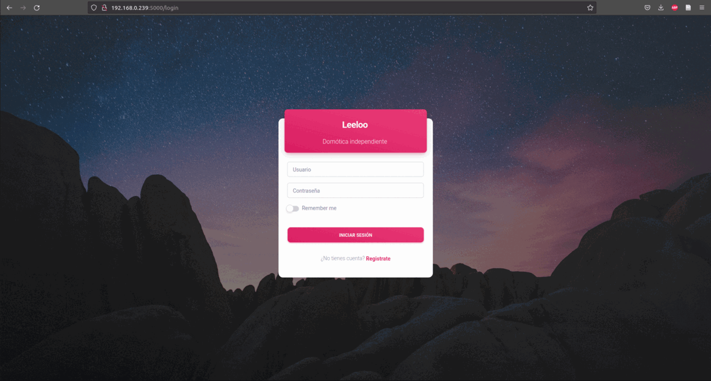

# Diseño e implementación de un sistema de domótica inteligente: Leeloo

  



## Demo

> Credenciales base ***test / pass*** o crea una cuenta [registro](https://www.creative-tim.com/live/material-dashboard-flask).

- **Material Dashboard Flask** [Login](https://www.creative-tim.com/live/material-dashboard-flask)

<br />

## Quick start

> Ejecuta el código mediante

```bash
$ # Creación del entorno virtual
$ virtualenv env
$ source env/bin/activate
$
$ # Instala los modulos para SQLite
$ pip3 install -r requirements.txt
$ python3 run.py
```
>Para que el proyecto funcione, el broker debe estar configurado

<br />

## Documentacion del template
La documentación para el template **Material Dashboard Flask** se encuentra en la siguiente [website](https://demos.creative-tim.com/material-dashboard-flask/docs/1.0/getting-started/getting-started-flask.html).

<br />

## Estructura del entorno
El proyecto sigue la siguiente estructura

```bash
< Raiz del Proyecto >
   |
   |-- apps/
   |    |
   |    |-- home/                          # Aplicación para servir archivos HTML
   |    |    |-- routes.py                 # Definición de rutas
   |    |
   |    |-- authentication/                # 
   |    |    |-- routes.py                 # Definición de las rutas de autorización
   |    |    |-- models.py                 # Definición de modelos
   |    |    |-- forms.py                  # Definición de los formularios
   |    |
   |    |-- static/
   |    |    |-- <css, JS, images>         # archivos CSS y JavaScript
   |    |
   |    |-- templates/                     # Templates usados para cargar las páginas
   |    |    |-- includes/                 # Código HTML reutilizado
   |    |    |    |-- navigation.html      # Navegación superior
   |    |    |    |-- sidebar.html         # Navegación lateral
   |    |    |    |-- footer.html          # Footer
   |    |    |    |-- scripts.html         # Scripts generales
   |    |    |
   |    |    |-- layouts/                   # Estilo de página principal
   |    |    |    |-- base-fullscreen.html  # Usada por las páginas de autorización
   |    |    |    |-- base.html             # Usada por el resto de páginas
   |    |    |
   |    |    |-- accounts/                  # Páginas para autentificarse
   |    |    |    |-- login.html            # Página de inicio
   |    |    |    |-- register.html         # Página de registro
   |    |    |
   |    |    |-- home/                      # Interfaz de Usuario Kit Pages
   |    |         |-- index.html            # Página principal
   |    |         |-- 404-page.html         # Página de error 404
   |    |         |-- tables.html           # Página de configuracion 
   |    |    	  |-- despensa.html	        # Página de despensa
   |    |
   |    |--ESPX.sh                          # Script para generar código de sensor x
   |    |
   |    |--ping.sh                          # Script para comprobar que la hay conexión con
   |    |                                   # la cámara  
   |    |
   |    |--compile.sh                       # Script para verificar, compilar y llamar a
   |    |                                   # arduino-cli
   |    |
   |    |--db.sqlite3                       # Base de datos
   |    |
   |    |--ESPx/                            # Código generado para sensor de tipo x
   |    |   |-- espx.ino
   |    |
   |    |--arduino-cli                      # Script para flashear modulo WiFi
   |    |                   
   |    |--model.h5                         # Modelo para la clasificación de
   |                                        # imáges
   |
   |  config.py                             # Configuración de la aplicación
   |    __init__.py                         # Inicialización de la aplicación
   |
   |-- requirements.txt                     # Módulos de desarrollo - SQLite storage
   |
   |-- Dockerfile                           # Ajustes para inicializar en Docker
   |-- gunicorn-cfg.py                      # Servidor HTTP   
   |-- nginx                                # 
   |    |-- appseed-app.conf                # Desarrollo
   |
   |-- .env                                 # Injección de configuración mediante el enviroment
   |-- run.py                               # Inicio de la App mediante WSGI
```

## Navegadores soportados

    

<br />

## Fuentes

- Demo template: <https://www.creative-tim.com/live/material-dashboard-flask>
- Página de descarga: <https://www.creative-tim.com/product/material-dashboard-flask>
- Documentación: <https://demos.creative-tim.com/material-dashboard-flask/docs/1.0/getting-started/getting-started-flask.html>
- Licencia: <https://www.creative-tim.com/license>

<br />

